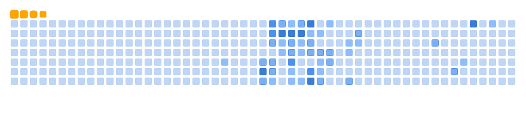

  <picture>
    <source media="(prefers-color-scheme: dark)" srcset="dist/github-snake-dark.svg">
    <source media="(prefers-color-scheme: light)" srcset="dist/github-snake.svg">
    
  </picture>

  

    Hi there! I’m glad you’re visiting my GitHub.  
Feel free to explore my projects, check out my work, and connect if something catches your eye.

---

  

---
## 🚀 Projects 

  

  

## 📊 GitHub Stats

  

    
    
  

---
## 🏆 GitHub Trophy

---

---
## 💻✨ Currently Working On

Here are some projects I’m actively developing and improving:  

  

  

---

## 🔗 Connect with Me

  
  
  
  
  
    

---

      Thanks again for stopping By

  

